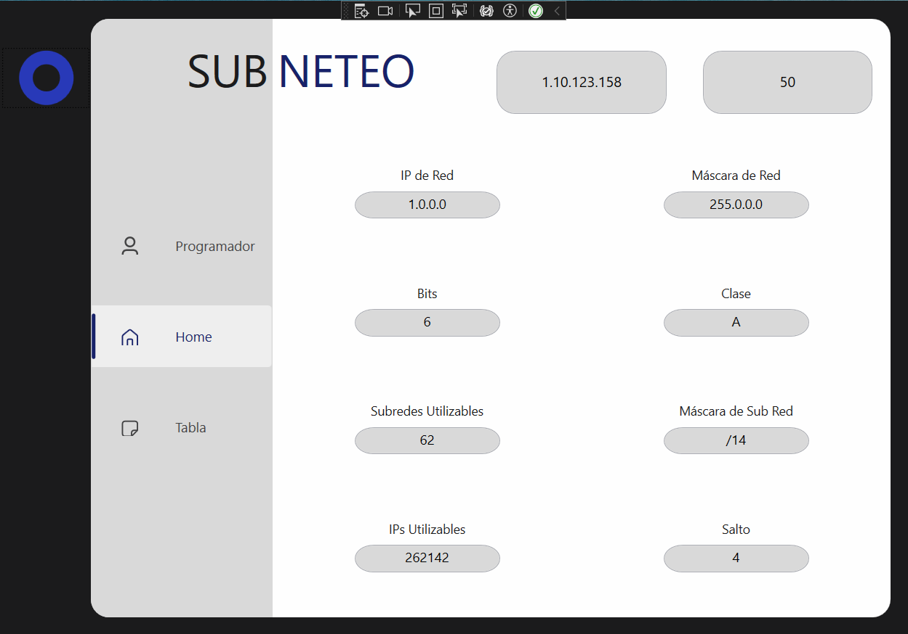
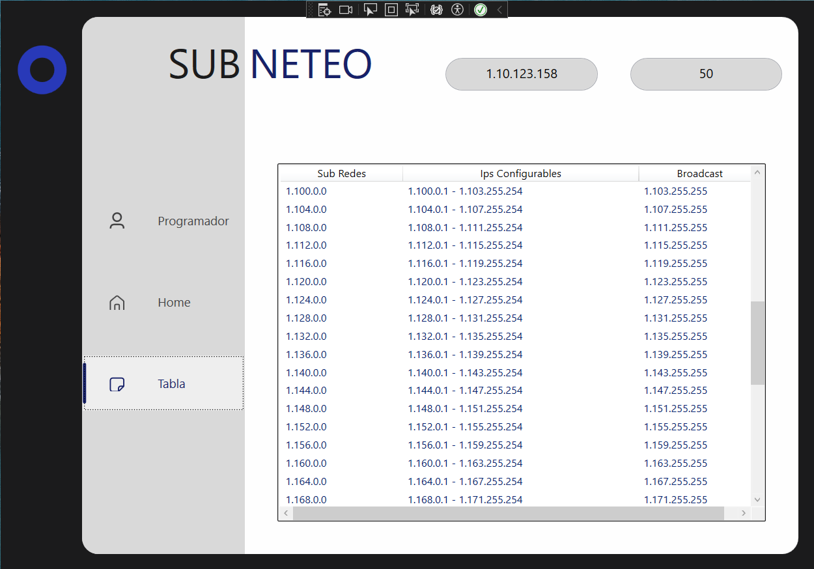

# Sub_Neteo
  

Welcome to Sub-Neteo, your powerful and user-friendly subnet calculator! Whether you're a networking student, an IT professional, or just curious about how networks work, Sub-Neteo makes subnetting easy, fast, and insightful.

## 🌐 What is Sub-Neteo?
Sub-Neteo is an interactive subnet calculator where you simply enter:

- An IP address
- The number of desired subnets

  …and instantly get:
  
✅ Network IP address
✅ Network mask
✅ Number of bits used for subnetting
✅ IP class (A, B, C…)
✅ Number of usable subnets
✅ Subnet mask
✅ Number of usable IP addresses per subnet
✅ Jump (the increment between subnets)

## 💻 Example
**Step 1: Select board size**  
Enter your IP address and the number of subnets you want:

**Step 2: See the results**  
Get instant results and subnet table.:

---
